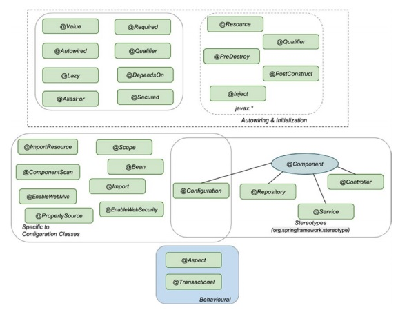
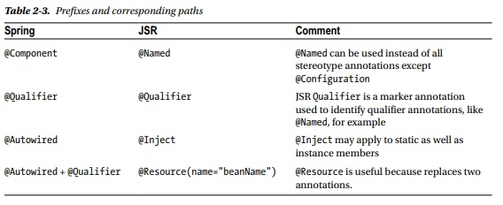
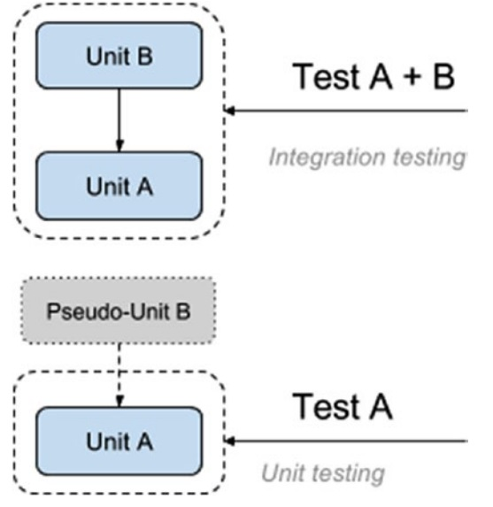

= Pet Sitter Fork

Next page 212

== Spring Bean LifeCycle and Configuration

Dependency Injection

----
* Factory, (static factory)
* Abstract Factory,
* Singleton,
* Builder,
* Decorator,
* Proxy,
* Service Locator,
* reflection.
----

----
This software design pattern implies that clients delegate the dependency resolution to an
external service. The client is not allowed to call the injector service, which is why this software pattern is
characterized by Inversion of Control behavior, also known as the Don’t call us, we’ll call you! principle.
----

Spring IoC and Dependency Injection

* AnnotationConfigApplicationContext
* ClassPathXmlApplicationContext

Spring Configuration

Stereotype annotations
----
@Component,
@Service,
@Repository
@Configuration,
@Bean
----

Using FactoryBean
InitializingBean
DisposableBean

@AliasFor

== Testing Spring Applications

Unit testing implies testing the smallest testable parts of an application individually and independently,
isolated from any other units that might affect their behavior in an unpredictable way.
The dependencies
are kept to a minimum, and most of them will be replaced with pseudo-units reproducing the expected
behavior

The pseudo-dependencies can be stubs or mocks

To enable support of Spring context
----
@RunWith(SpringJUnit4ClassRunner.class)
@ContextConfiguration(locations = {"classpath:spring/test-cfg.xml"})
----

May be used for init mock as Dependency
----
@InjectMocks
----

All tests are passed

How to build Gradle report

== Aspect Oriented Programming with Spring

== Data Access

== Spring Web

== Spring Advanced Topics

== Spring Microservices with Spring Cloud

== Building and Deploying
This is a Gradle multi-module project. The *-practice projects, have tests and pieces left unimplemented so building the full project using:
----
gradle build
----
will fail.

To build the full project and skipping tests, build from the root (`pet-sitter`) directory:
----
gradle build -x test
----

To build the project and ignore failed tests so you can get your full build status with Gradle Receipt, build from the root (`pet-sitter`) directory, using the following command:
----
gradle build -Dscan --continue
----
Just keep in mind, the project is quite big and when displaying the results, you browser might be slow.

German unicode characters here: http://javawiki.sowas.com/doku.php?id=java:unicode

== Observation

The ojdbc artifact is not available in Maven public repository.
There are two possible solutions:

* download it from the Official Oracle site and store it in the ~/.m2/repository/.. where Gradle is expecting to find it.
* in build.gradle replace this line:
----
ojdbc             : "com.oracle:ojdbc7:12.1.0.2",
----
with  this line:
----
ojdbc             : "com.github.noraui:ojdbc7:12.1.0.2.0"
----

I'm not sure how long the artifact will be available there (https://mvnrepository.com/artifact/com.github.noraui/ojdbc7/12.1.0.2),
because Oracle licensing might prevent people from sharing their artifacts on public servers, so for long term use, the first solution is recommended.